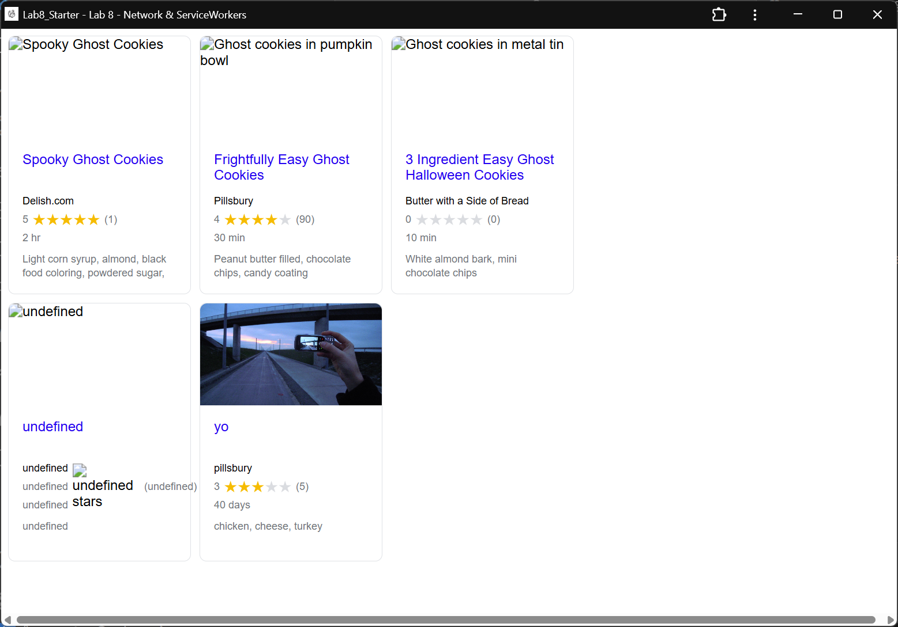

# Lab8-Starter
Name: Nikhil Akiti

Paragraph:
Graceful degradation relates to designing a website so that it still maintains functionality even with limited resources or when performance is limited. Service workers help in this process as they allow for offline access and caching resources, which means that an application can still function when it can't connect to a network. This means that users can still use the application even when they lack some functionality, which is a key part of graceful degradation. 

https://nakiti.github.io/Lab8_Starter/